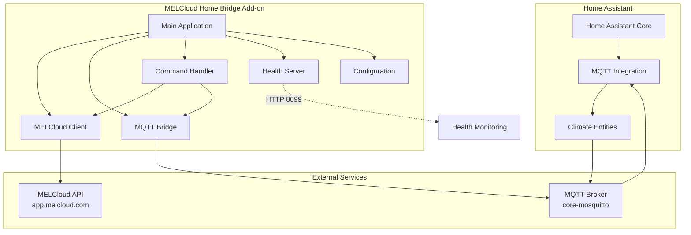
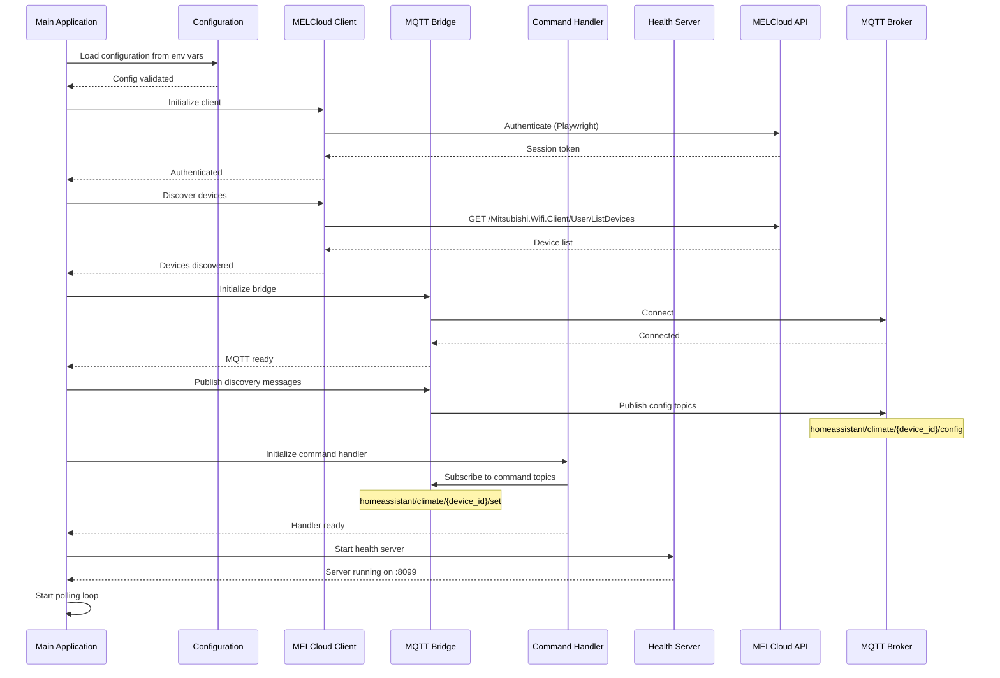
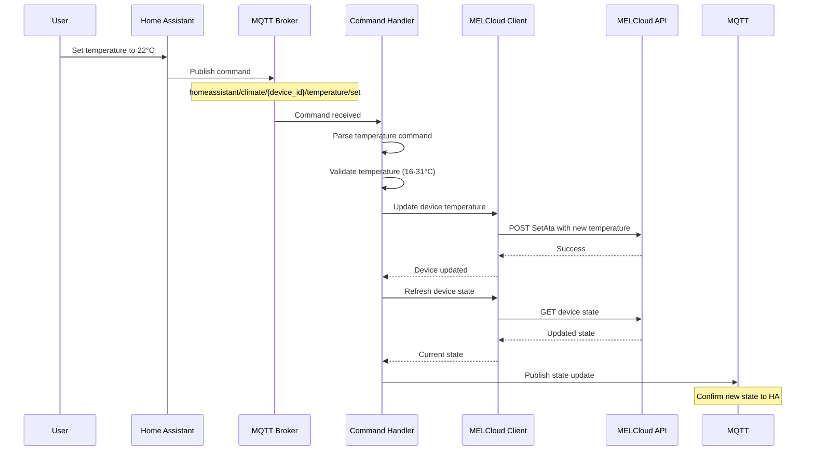
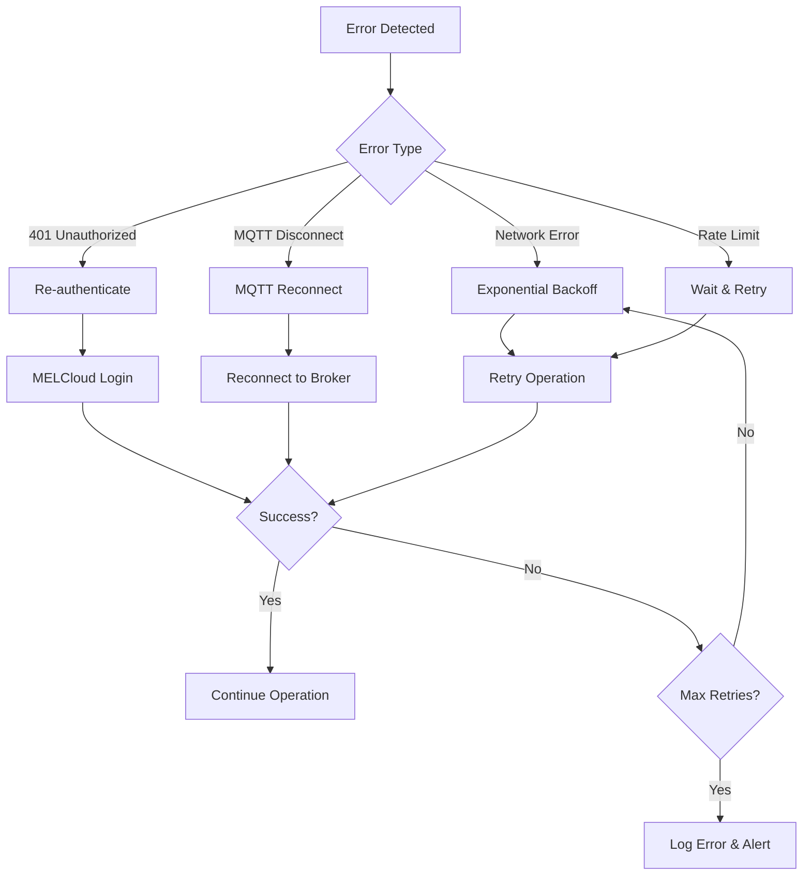
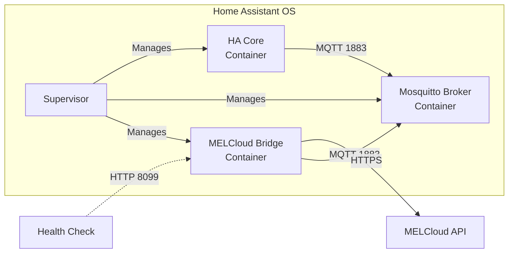

# MELCloud Home Bridge Architecture

This document describes the architecture, startup flow, and data flows of the MELCloud Home Bridge add-on.

## System Overview



## Startup Flow



## Data Flow - State Updates

```mermaid
sequenceDiagram
    participant Loop as Polling Loop
    participant MEL as MELCloud Client
    participant API as MELCloud API
    participant MQTT as MQTT Bridge
    participant Broker as MQTT Broker
    participant HA as Home Assistant

    loop Every poll_interval (default 60s)
        Loop->>MEL: Poll device states
        MEL->>API: GET device states
        API-->>MEL: Current states
        MEL-->>Loop: Device states

        Loop->>Loop: Detect state changes

        alt State changed
            Loop->>MQTT: Publish state update
            MQTT->>Broker: Publish to state topic
            Note over Broker: homeassistant/climate/{device_id}/state
            Broker->>HA: State update
            HA->>HA: Update climate entity
        else No change
            Note over Loop: Skip publish
        end
    end
```

## Data Flow - Commands from Home Assistant



## Component Details

### Main Application (`app/main.py`)

- **Responsibility**: Application lifecycle management, polling loop orchestration
- **Key Functions**:
  - `main()`: Entry point, initializes all components
  - `run()`: Polling loop for state synchronization
  - `cleanup()`: Graceful shutdown (disconnect MQTT, close MELCloud session)

### MELCloud Client (`app/melcloud_client.py`)

- **Responsibility**: MELCloud API communication, authentication, device management
- **Key Functions**:
  - `authenticate()`: Browser automation-based login to MELCloud using pymelcloudhome v0.3.0
  - `discover_devices()`: Fetch all devices from MELCloud account
  - `get_device_state()`: Get current state of a specific device
  - `set_temperature()`, `set_mode()`, `set_power()`: Device control
  - `_reauthenticate()`: Automatic session renewal on 401 errors
- **Browser Automation**: Uses system Chromium (`/usr/bin/chromium`) with Pyppeteer for headless authentication

### MQTT Bridge (`app/mqtt_bridge.py`)

- **Responsibility**: MQTT communication, Home Assistant Discovery protocol
- **Key Functions**:
  - `connect()`: Connect to MQTT broker with reconnection logic
  - `publish_discovery()`: Publish HA Discovery config messages
  - `publish_state()`: Publish device state updates
  - `subscribe_commands()`: Subscribe to command topics
  - `_on_message()`: Route incoming MQTT messages to command handler

### Command Handler (`app/command_handler.py`)

- **Responsibility**: Parse and execute commands from Home Assistant
- **Key Functions**:
  - `handle_temperature_command()`: Process temperature setpoint changes
  - `handle_mode_command()`: Process HVAC mode changes
  - `parse_temperature_command()`: Extract temperature from payload
  - `parse_mode_command()`: Map HA mode to MELCloud mode

### Health Server (`app/health_server.py`)

- **Responsibility**: Health monitoring endpoint for external monitoring
- **Endpoint**: `GET /healthz` on port 8099
- **Health Checks**:
  - MELCloud authenticated
  - MQTT broker connected
  - Recent poll (within 5 minutes)
- **Response**: JSON with status, uptime, device count

### Configuration (`app/config.py`)

- **Responsibility**: Load and validate configuration from environment variables
- **Schema**: Pydantic v2 BaseSettings model
- **Validation**: Email format, port ranges, poll interval constraints
- **Secrets**: Credential sanitization in logs

## Error Handling & Resilience



### Retry Strategies

- **MELCloud API**: Exponential backoff with jitter (max 5 retries)
- **MQTT Broker**: Automatic reconnection with exponential backoff
- **Session Expiry**: Automatic re-authentication on 401 responses
- **State Polling**: Continue polling even if individual device fails

## Performance Characteristics

- **Memory Usage**: ~50MB base + ~10MB per device (100 devices ≈ 1GB)
- **CPU Usage**: <1% idle, <5% during polling
- **Network**: ~1KB per device per poll (60s interval = 1KB/min/device)
- **MQTT Messages**: 2 per device per poll (discovery config + state update)
- **API Calls**: 1 per device per poll + 1 auth per session

## Deployment Architecture



### Container Details

- **Base Image**: `ghcr.io/home-assistant/amd64-base-python:3.11-alpine3.19`
- **Multi-Arch**: amd64, aarch64, armv7
- **Browser**: System Chromium (`/usr/bin/chromium`) for browser automation
- **Dependencies**: pymelcloudhome v0.3.0+ with native Alpine Linux support
- **Ports**: 8099 (health check endpoint)
- **Volumes**: None (stateless operation)
- **Networking**: Host network mode (Home Assistant add-on convention)

## Security Considerations

- **Credentials**: Stored in Home Assistant Supervisor environment (encrypted at rest)
- **Logs**: Passwords sanitized before logging (regex-based scrubbing)
- **MQTT**: Supports username/password authentication
- **TLS**: MELCloud API uses HTTPS, MQTT can use TLS if configured
- **Browser**: System Chromium runs in headless mode within sandboxed container
- **Secrets**: Never written to disk, only in memory

## Monitoring & Observability

### Health Endpoint

```bash
curl http://homeassistant.local:8099/healthz
```

Response:

```json
{
  "status": "healthy",
  "melcloud_connected": true,
  "mqtt_connected": true,
  "last_poll": "2025-10-28T10:30:00Z",
  "device_count": 3,
  "uptime_seconds": 86400
}
```

### Log Levels

- **DEBUG**: All API calls, MQTT messages, state changes
- **INFO**: Startup, authentication, device discovery, errors (default)
- **WARNING**: Transient errors, retries
- **ERROR**: Permanent failures, configuration errors

### Metrics (Future Enhancement)

- Poll latency histogram
- API success rate
- MQTT message rate
- Authentication failure count
- Device error states

## Future Enhancements

- **Prometheus Metrics**: Expose /metrics endpoint with detailed statistics
- **Event-based Updates**: Subscribe to MELCloud push notifications (if available)
- **Device Grouping**: Support for MELCloud building/floor/area hierarchy
- **Energy Monitoring**: Track power consumption if available from API
- **Diagnostics**: Capture diagnostic dump for troubleshooting
- **Configuration UI**: Web-based configuration instead of YAML
