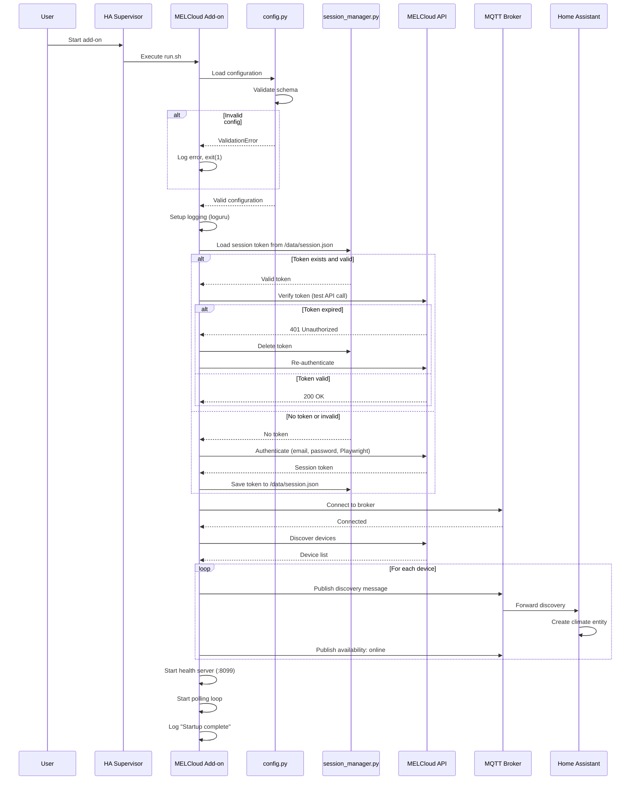
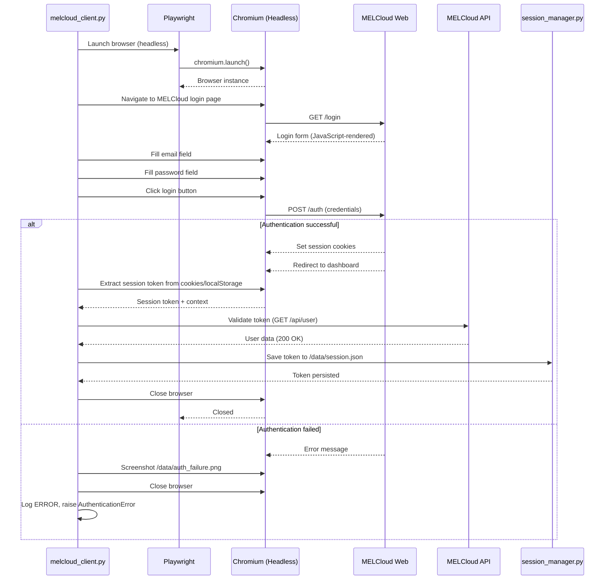
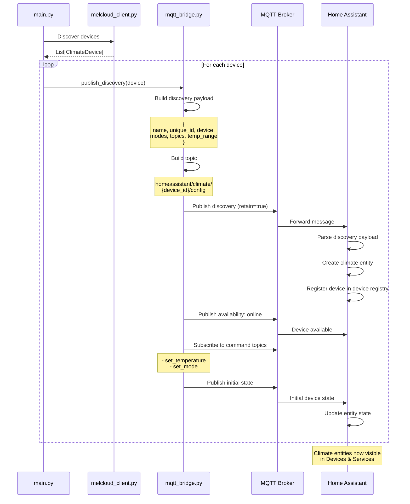
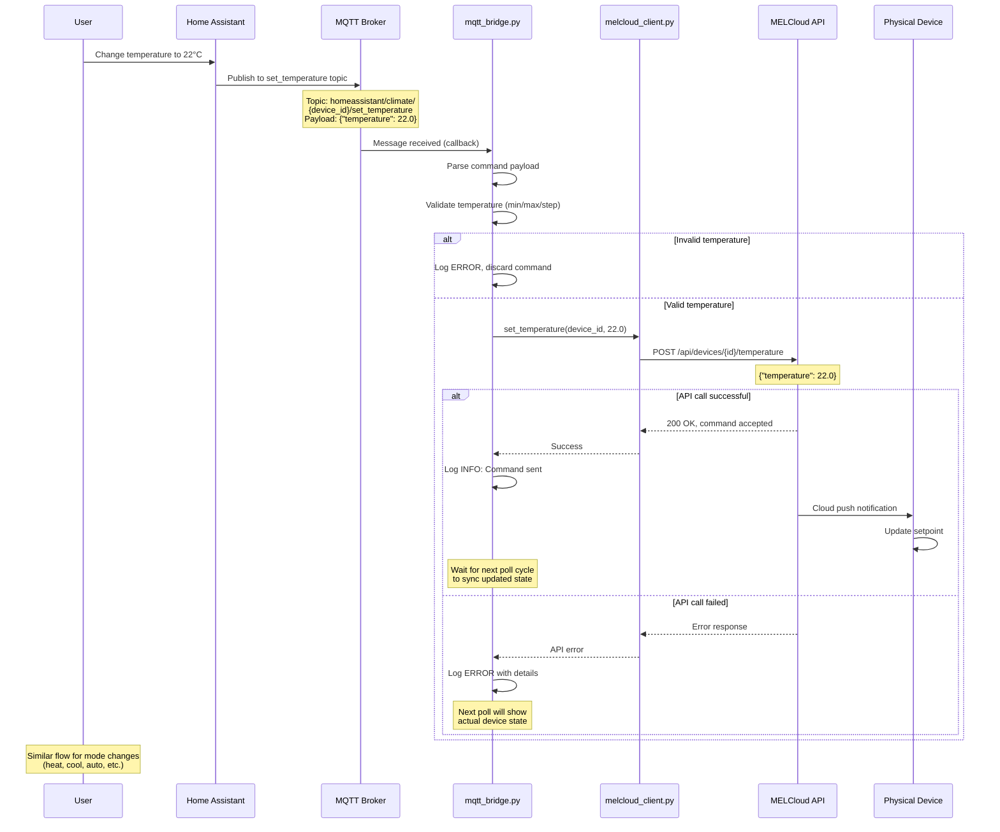
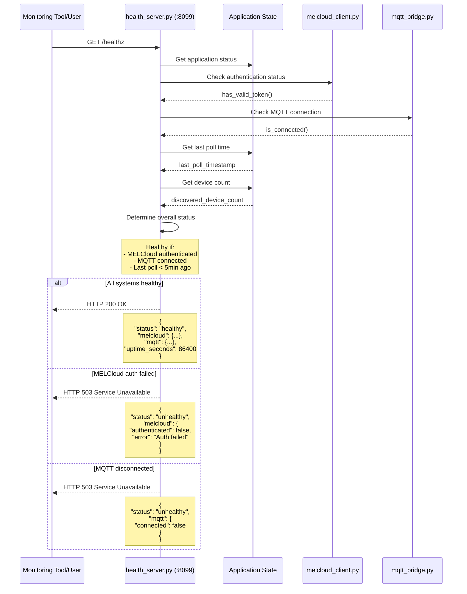

# Implementation Plan: MELCloud Home Bridge

**Branch**: `001-melcloud-home-bridge` | **Date**: 2025-10-28 | **Spec**: [spec.md](./spec.md)  
**Input**: Feature specification from `/specs/001-melcloud-home-bridge/spec.md`

**Note**: This template is filled in by the `/speckit.plan` command. See `.specify/templates/commands/plan.md` for the execution workflow.

## Summary

Home Assistant add-on that bridges Mitsubishi MELCloud climate devices to Home Assistant via MQTT Discovery protocol. Uses Playwright-backed pymelcloudhome library for authentication and device management. Containerized solution with all dependencies (Chromium browser, Python runtime) pre-installed. Provides automatic device discovery, bidirectional control (HA ↔ MELCloud), resilient operation with exponential backoff retry logic, and health monitoring endpoint.

**Technical Approach**: Python async application using pymelcloudhome for MELCloud API, Playwright for browser automation, paho-mqtt for MQTT communication. Follows Home Assistant Supervisor add-on architecture with config.json schema, /data persistent storage, and standard lifecycle hooks.

## Technical Context

**Language/Version**: Python 3.11+ (matches Home Assistant core)  
**Primary Dependencies**: playwright (browser automation), pymelcloudhome (MELCloud API), paho-mqtt (MQTT client), aiohttp (async HTTP), loguru (structured logging)  
**Storage**: File-based JSON in `/data/session.json` for session token persistence  
**Testing**: pytest (unit tests), pytest-asyncio (async tests), pytest-mock (mocking external APIs)  
**Target Platform**: Docker container (Linux-based) on Home Assistant Supervisor (HAOS, Container, Supervised installations)  
**Project Type**: Single containerized application (Home Assistant add-on)  
**Performance Goals**: Poll cycle <30s, device discovery <60s (up to 10 devices), command execution <15s, health endpoint <1s response  
**Constraints**: Memory <200MB sustained, 7-day uptime without restart, graceful degradation on network failures  
**Scale/Scope**: Support 1-20 MELCloud devices per account, concurrent operation in 100+ Home Assistant installations, multi-arch (amd64, aarch64, armv7)

## Constitution Check

_GATE: Must pass before Phase 0 research. Re-check after Phase 1 design._

### ✅ I. Code Clarity First

- **Status**: PASS
- **Validation**: Module structure (config, logging, mqtt_bridge, main) enforces single-purpose design. Function names describe intent (authenticate_melcloud, discover_devices, publish_mqtt_discovery). No complex one-liners planned.

### ✅ II. Simple Logging

- **Status**: PASS
- **Validation**: Loguru configured with clear levels (DEBUG/INFO/WARNING/ERROR). Human-readable format. No credential logging. Structured fields for MELCloud API calls, MQTT operations, device states.

### ✅ III. Minimal Configuration

- **Status**: PASS
- **Validation**: Only 4 required fields (email, password, mqtt_host, mqtt_port). Defaults for optional fields (base_topic=homeassistant, poll_interval=60, log_level=INFO). Schema validation via config.json.

### ✅ IV. Containerized Browser Automation

- **Status**: PASS
- **Validation**: Playwright and Chromium installed during Docker build (playwright install --with-deps chromium). Headless mode default. Screenshot capture on auth failure. Browser restart on crash.

### ✅ V. Home Assistant Add-on Conventions

- **Status**: PASS
- **Validation**: config.json schema with proper types/defaults. /data directory for persistence. MQTT Discovery protocol with device/entity/availability topics. Health endpoint for Supervisor. Proper shutdown signals.

### ✅ VI. Test-Driven Development

- **Status**: PASS
- **Validation**: Unit tests for config validation, MQTT message formatting, session token management. Integration tests for auth flow, device discovery, command handling. Mocked MELCloud API for CI. Manual test guide for live API.

### ✅ VII. Step-by-Step Documentation

- **Status**: PASS
- **Validation**: README with prerequisites, installation steps, configuration guide, troubleshooting. Quickstart guide <5 steps for first device. FAQ for common issues. Architecture diagrams included.

## Project Structure

### Documentation (this feature)

```text
specs/001-melcloud-home-bridge/
├── plan.md              # This file (/speckit.plan command output)
├── research.md          # Phase 0 output - technology decisions & patterns
├── data-model.md        # Phase 1 output - entities & state management
├── quickstart.md        # Phase 1 output - 5-step setup guide
├── contracts/           # Phase 1 output - MQTT & config schemas
│   ├── mqtt-discovery-schema.json
│   ├── mqtt-state-schema.json
│   ├── mqtt-command-schema.json
│   └── addon-config-schema.json
└── tasks.md             # Phase 2 output (/speckit.tasks command - NOT created by /speckit.plan)
```

### Source Code (repository root)

```text
melcloudhome-addon/
├── Dockerfile                    # Multi-stage build with Playwright
├── build.yaml                    # Home Assistant build config (multi-arch)
├── config.yaml                   # Add-on metadata & options schema
├── README.md                     # User documentation
├── CHANGELOG.md                  # Version history
├── run.sh                        # Container entrypoint script
├── requirements.txt              # Python dependencies
│
├── app/                          # Main application code
│   ├── __init__.py
│   ├── main.py                   # Entry point, orchestration
│   ├── config.py                 # Configuration loading & validation
│   ├── logging_conf.py           # Loguru setup & formatters
│   ├── mqtt_bridge.py            # MQTT client & discovery publishing
│   ├── melcloud_client.py        # Wrapper for pymelcloudhome
│   ├── session_manager.py        # Session token persistence
│   ├── health_server.py          # HTTP health endpoint (:8099/healthz)
│   └── utils.py                  # Helpers (exponential backoff, sanitization)
│
├── tests/                        # Test suite
│   ├── __init__.py
│   ├── conftest.py               # pytest fixtures
│   ├── unit/                     # Unit tests
│   │   ├── test_config.py
│   │   ├── test_mqtt_bridge.py
│   │   ├── test_session_manager.py
│   │   └── test_utils.py
│   ├── integration/              # Integration tests
│   │   ├── test_auth_flow.py
│   │   ├── test_device_discovery.py
│   │   └── test_command_handling.py
│   └── fixtures/                 # Test data
│       ├── mock_melcloud_devices.json
│       └── mock_config.yaml
│
└── .github/                      # CI/CD workflows
    └── workflows/
        ├── test.yaml             # Run tests on PR
        └── build.yaml            # Multi-arch container builds
```

**Structure Decision**: Single containerized application following Home Assistant add-on conventions. Simple flat structure in `app/` directory promotes code clarity (Constitution Principle I). All business logic in Python modules, infrastructure in container/config files. Tests mirror source structure for maintainability.

## Complexity Tracking

> No constitutional violations - all principles satisfied by design.

## Phase 0: Research & Technology Decisions

### Research Questions

1. **pymelcloudhome Integration Patterns**

   - How to handle session token lifecycle with pymelcloudhome?
   - Best practices for Playwright browser automation in containers?
   - Device discovery API flow and state synchronization patterns?

2. **MQTT Discovery Protocol**

   - Home Assistant MQTT Discovery schema for climate entities?
   - Availability topic patterns and will/testament messages?
   - State vs command topic structures?

3. **Error Recovery Strategies**

   - Exponential backoff algorithm parameters (initial delay, max delay, multiplier)?
   - Session expiration detection and re-authentication flow?
   - MQTT reconnection patterns with paho-mqtt?

4. **Multi-Architecture Container Builds**
   - Playwright installation on ARM architectures (aarch64, armv7)?
   - Docker buildx patterns for cross-platform builds?
   - Base image selection for HA add-on compatibility?

### Research Output

See [research.md](./research.md) for detailed findings.

---

## Phase 1: Design Artifacts

### Data Model

See [data-model.md](./data-model.md) for complete entity definitions, state management, and relationships.

**Key Entities**:

- `ClimateDevice`: MELCloud HVAC unit representation
- `SessionToken`: MELCloud authentication token
- `MQTTDiscoveryMessage`: Home Assistant discovery payload
- `Configuration`: User settings from HA config UI

### API Contracts

See [contracts/](./contracts/) directory for JSON schemas:

- `mqtt-discovery-schema.json`: MQTT Discovery config payload
- `mqtt-state-schema.json`: Climate state updates
- `mqtt-command-schema.json`: Command messages from HA
- `addon-config-schema.json`: Add-on configuration schema

### Quickstart Guide

See [quickstart.md](./quickstart.md) for 5-step installation and setup guide.

---

## Sequence Diagrams

### 1. Startup Sequence



### 2. Authentication Flow (Login with Playwright)



### 3. Polling Loop Sequence

```mermaid
sequenceDiagram
    participant Loop as Polling Loop (main.py)
    participant MEL as melcloud_client.py
    participant API as MELCloud API
    participant MQTT as mqtt_bridge.py
    participant Broker as MQTT Broker
    participant Backoff as ExponentialBackoff

    loop Every poll_interval seconds
        Loop->>MEL: Get current device states
        MEL->>API: GET /api/devices/{device_id}/state

        alt API call successful
            API-->>MEL: Device state data
            MEL-->>Loop: List of ClimateDevice objects

            Loop->>Loop: Compare with previous state

            alt State changed
                loop For each changed device
                    Loop->>MQTT: Publish state update
                    MQTT->>Broker: Publish to state topic
                end
            end

            Loop->>Backoff: Reset backoff (success)
            Loop->>Loop: Sleep(poll_interval)

        else Network error
            API-->>MEL: ConnectionError/Timeout
            MEL-->>Loop: Network error
            Loop->>Backoff: Get next delay
            Backoff-->>Loop: Delay (exponential)
            Loop->>Loop: Log WARNING, retry after delay
            Loop->>Loop: Sleep(backoff_delay)

        else Session expired (401)
            API-->>MEL: 401 Unauthorized
            MEL-->>Loop: SessionExpiredError
            Loop->>MEL: Re-authenticate
            MEL->>API: Authenticate via Playwright
            API-->>MEL: New session token
            MEL->>MEL: Save token to /data/session.json
            MEL-->>Loop: Re-authenticated
            Loop->>Backoff: Reset backoff
            Loop->>Loop: Retry immediately

        else MELCloud API error (500)
            API-->>MEL: 500 Internal Server Error
            MEL-->>Loop: API error
            Loop->>Backoff: Get next delay
            Loop->>Loop: Log ERROR, maintain last known state
            Loop->>Loop: Sleep(backoff_delay)
        end
    end
```

### 4. MQTT Discovery Sequence



### 5. Command Handling Sequence



### 6. Error Recovery - Session Expiration

```mermaid
sequenceDiagram
    participant Loop as Polling Loop
    participant MEL as melcloud_client.py
    participant API as MELCloud API
    participant PW as Playwright
    participant Session as session_manager.py
    participant MQTT as MQTT Broker

    Loop->>MEL: Get device states
    MEL->>API: GET /api/devices
    API-->>MEL: 401 Unauthorized
    MEL-->>Loop: SessionExpiredError

    Loop->>Loop: Log WARNING: Session expired
    Loop->>MEL: Re-authenticate

    MEL->>Session: Load stored credentials
    alt Credentials available
        Session-->>MEL: email, password
        MEL->>PW: Authenticate via Playwright

        alt Re-auth successful
            PW-->>MEL: New session token
            MEL->>Session: Save new token
            MEL-->>Loop: Re-authenticated successfully
            Loop->>Loop: Log INFO: Re-auth successful
            Loop->>MEL: Retry get_device_states
            MEL->>API: GET /api/devices (new token)
            API-->>MEL: 200 OK, device data
            MEL-->>Loop: Device states
            Loop->>MQTT: Publish state updates

        else Re-auth failed (wrong credentials)
            PW-->>MEL: AuthenticationError
            MEL-->>Loop: Authentication failed
            Loop->>Loop: Log ERROR: Credentials invalid
            Loop->>MQTT: Publish all devices: unavailable
            Loop->>Loop: Sleep(poll_interval), retry later
        end

    else No stored credentials
        Session-->>MEL: Credentials not available
        MEL-->>Loop: Cannot re-authenticate
        Loop->>Loop: Log ERROR: Config update required
        Loop->>MQTT: Publish all devices: unavailable
        Loop->>Loop: Continue running (wait for config fix)
    end
```

### 7. Health Endpoint Sequence



---

## Requirements to Implementation Mapping

### Functional Requirements Implementation

| Requirement                           | Implementation          | Files                          | Functions/Classes                                                       |
| ------------------------------------- | ----------------------- | ------------------------------ | ----------------------------------------------------------------------- |
| **FR-001**: Authenticate to MELCloud  | Playwright-based login  | `app/melcloud_client.py`       | `authenticate_melcloud()`, `MelCloudClient._playwright_login()`         |
| **FR-002**: Persist session tokens    | JSON file storage       | `app/session_manager.py`       | `SessionManager.save_token()`, `SessionManager.load_token()`            |
| **FR-003**: Discover devices          | API polling             | `app/melcloud_client.py`       | `MelCloudClient.discover_devices()`                                     |
| **FR-004**: Publish MQTT Discovery    | MQTT client             | `app/mqtt_bridge.py`           | `MQTTBridge.publish_discovery()`                                        |
| **FR-005**: Device metadata           | Discovery payload       | `app/mqtt_bridge.py`           | `MQTTBridge._build_discovery_payload()`                                 |
| **FR-006**: Climate entity attributes | State messages          | `app/mqtt_bridge.py`           | `MQTTBridge.publish_state()`                                            |
| **FR-007**: Subscribe to commands     | MQTT subscriptions      | `app/mqtt_bridge.py`           | `MQTTBridge._on_temperature_command()`, `MQTTBridge._on_mode_command()` |
| **FR-008**: Send control commands     | MELCloud API calls      | `app/melcloud_client.py`       | `MelCloudClient.set_temperature()`, `MelCloudClient.set_mode()`         |
| **FR-009**: Poll at intervals         | Async event loop        | `app/main.py`                  | `polling_loop()`                                                        |
| **FR-010**: Exponential backoff       | Utility class           | `app/utils.py`                 | `ExponentialBackoff` class                                              |
| **FR-011**: Detect 401, re-auth       | Error handling          | `app/melcloud_client.py`       | `MelCloudClient._handle_api_error()`                                    |
| **FR-012**: Availability status       | MQTT availability topic | `app/mqtt_bridge.py`           | `MQTTBridge.publish_availability()`                                     |
| **FR-013**: Config validation         | Schema validation       | `app/config.py`                | `Configuration.validate()`                                              |
| **FR-014**: Health endpoint           | HTTP server             | `app/health_server.py`         | `health_handler()`, `run_health_server()`                               |
| **FR-015**: Config UI schema          | Add-on config           | `config.yaml`                  | Schema definition in YAML                                               |
| **FR-016**: Containerized Playwright  | Dockerfile              | `Dockerfile`                   | `RUN playwright install --with-deps chromium`                           |
| **FR-017**: Multi-arch builds         | Build config            | `build.yaml`                   | Architecture matrix definition                                          |
| **FR-018**: Structured logging        | Loguru setup            | `app/logging_conf.py`          | `setup_logging()`                                                       |
| **FR-019**: Default MQTT settings     | Config defaults         | `config.yaml`, `app/config.py` | Default values in schema                                                |
| **FR-020**: Graceful shutdown         | Signal handling         | `app/main.py`                  | `shutdown_handler()`, async cleanup                                     |

### User Stories to Implementation Mapping

#### US1: Install and Configure Add-on

- **Files**: `config.yaml`, `app/config.py`, `README.md`
- **Implementation**: HA Supervisor integration, schema validation, user documentation

#### US2: Automatic Device Discovery

- **Files**: `app/melcloud_client.py`, `app/mqtt_bridge.py`, `app/main.py`
- **Functions**: `discover_devices()`, `publish_discovery()`, polling loop

#### US3: Real-time Device Control

- **Files**: `app/mqtt_bridge.py`, `app/melcloud_client.py`
- **Functions**: MQTT command callbacks, MELCloud API setters, state publishing

#### US4: Resilient Operation

- **Files**: `app/utils.py`, `app/melcloud_client.py`, `app/mqtt_bridge.py`
- **Functions**: `ExponentialBackoff`, error handlers, reconnection logic

#### US5: Health Monitoring

- **Files**: `app/health_server.py`, `app/logging_conf.py`
- **Functions**: `/healthz` endpoint, structured logging setup

---

## External Dependencies

### Python Packages (requirements.txt)

```txt
playwright>=1.40.0          # Browser automation for MELCloud auth
pymelcloudhome>=1.0.0       # MELCloud API client library
paho-mqtt>=1.6.1            # MQTT client
aiohttp>=3.9.0              # Async HTTP server (health endpoint)
loguru>=0.7.0               # Structured logging
```

### System Dependencies (Dockerfile)

- Python 3.11 base image (from Home Assistant base images)
- Playwright system dependencies (installed via `playwright install-deps`)
- Chromium browser (installed via `playwright install chromium`)

### Home Assistant Integration Dependencies

- **MQTT Integration**: Required in Home Assistant for receiving discovery messages
- **MQTT Broker**: Mosquitto add-on or external broker
- **Supervisor**: For add-on lifecycle management and config UI

---

## Add-on Configuration Schema (config.yaml)

```yaml
name: MELCloud Home Bridge
version: 1.0.0
slug: melcloudhome
description: Integrate Mitsubishi MELCloud climate devices via MQTT Discovery
url: https://github.com/YOUR_USERNAME/melcloudhome-addon
arch:
  - amd64
  - aarch64
  - armv7
startup: services
boot: auto
ports:
  8099/tcp: 8099
ports_description:
  8099/tcp: Health check endpoint
options:
  melcloud_email: ""
  melcloud_password: ""
  mqtt_host: "core-mosquitto"
  mqtt_port: 1883
  mqtt_username: ""
  mqtt_password: ""
  mqtt_base_topic: "homeassistant"
  poll_interval: 60
  log_level: "INFO"
schema:
  melcloud_email: email
  melcloud_password: password
  mqtt_host: str
  mqtt_port: port
  mqtt_username: str?
  mqtt_password: password?
  mqtt_base_topic: str
  poll_interval: int(10,3600)
  log_level: list(DEBUG|INFO|WARNING|ERROR)
```

---

## Phase 2: Task Breakdown

Task breakdown will be generated by `/speckit.tasks` command. Expected task categories:

1. **Infrastructure Setup**: Dockerfile, requirements.txt, config.yaml, build.yaml
2. **Core Application**: main.py orchestration, configuration loading, logging setup
3. **MELCloud Integration**: Authentication, device discovery, API client wrapper
4. **MQTT Bridge**: Discovery publishing, state updates, command handling
5. **Session Management**: Token persistence, validation, refresh logic
6. **Error Handling**: Exponential backoff, reconnection logic, error logging
7. **Health Monitoring**: HTTP endpoint, status aggregation
8. **Testing**: Unit tests, integration tests, fixtures
9. **Documentation**: README, quickstart guide, troubleshooting
10. **CI/CD**: GitHub Actions, multi-arch builds, automated tests

---

## Next Steps

1. ✅ Phase 0 Complete: Research and technology decisions documented
2. ✅ Phase 1 Complete: Data models, contracts, and quickstart guide created
3. ➡️ Ready for `/speckit.tasks`: Generate detailed implementation task list
4. ⏭️ Begin implementation following task priorities

---

## Summary

This implementation plan provides:

- ✅ Complete technical architecture aligned with constitution principles
- ✅ Detailed sequence diagrams for all critical flows (7 diagrams)
- ✅ Requirements-to-implementation traceability matrix (20 requirements mapped)
- ✅ File structure with clear responsibilities (9 core modules)
- ✅ External dependencies documented (Python packages, system deps, HA integrations)
- ✅ JSON schemas for all contracts (4 schemas)
